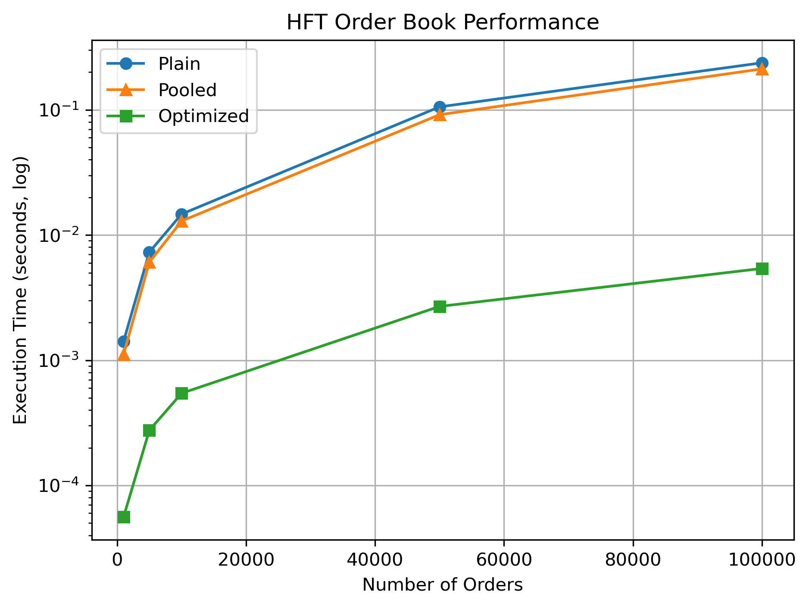
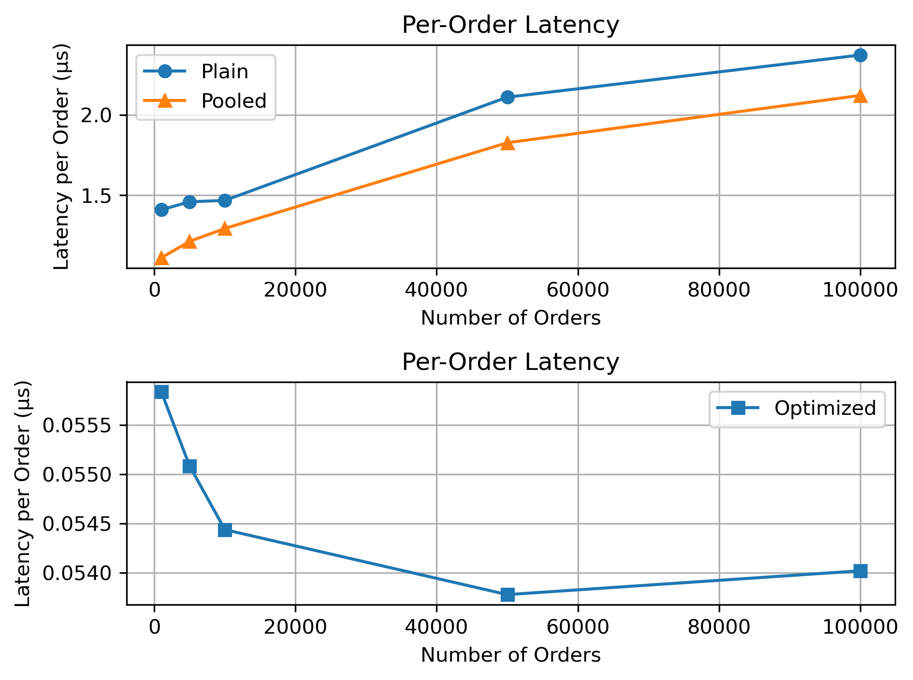

## Phase 5
Group 7
Scott Turro Kyle Parran

## Performance Results


Our optimized order gave much better results. By pre-reserving memory and loop unrolling we had a significant performance increase. 

## Latency Results


The latency in the plain and pooled version increases with the number of orders. Our optimized version has a much lower latency. At first the latency gets smaller with the number of orders, but then it increases again. This reflects the amount of overhead which does not scale with the number of orders.

## Unit Test Results
```
Core unit tests passed!
Stress test passed with 1000 orders!
Randomized consistency test passed with 1000 orders!
Stress test passed with 10000 orders!
Randomized consistency test passed with 10000 orders!
Stress test passed with 100000 orders!
Randomized consistency test passed with 100000 orders!
Stress test passed with 1000000 orders!
Randomized consistency test passed with 1000000 orders!
Stress test passed with 10000000 orders!
Randomized consistency test passed with 10000000 orders!
```